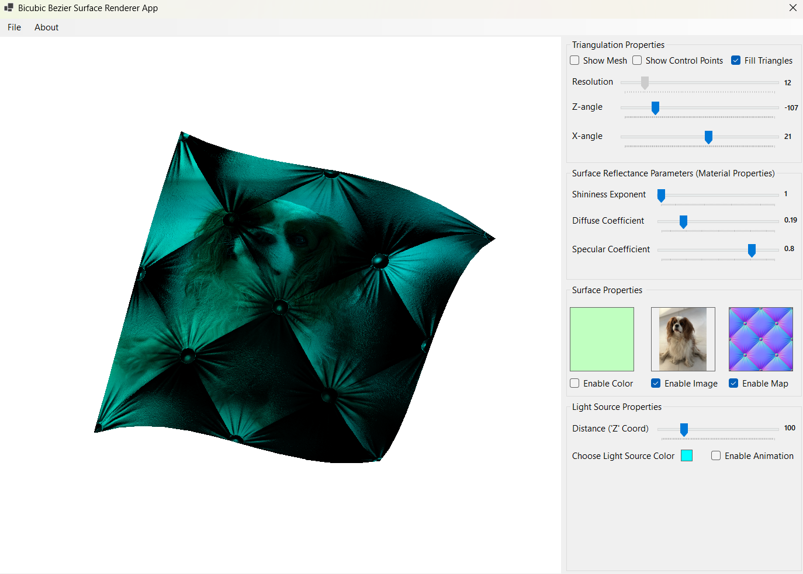
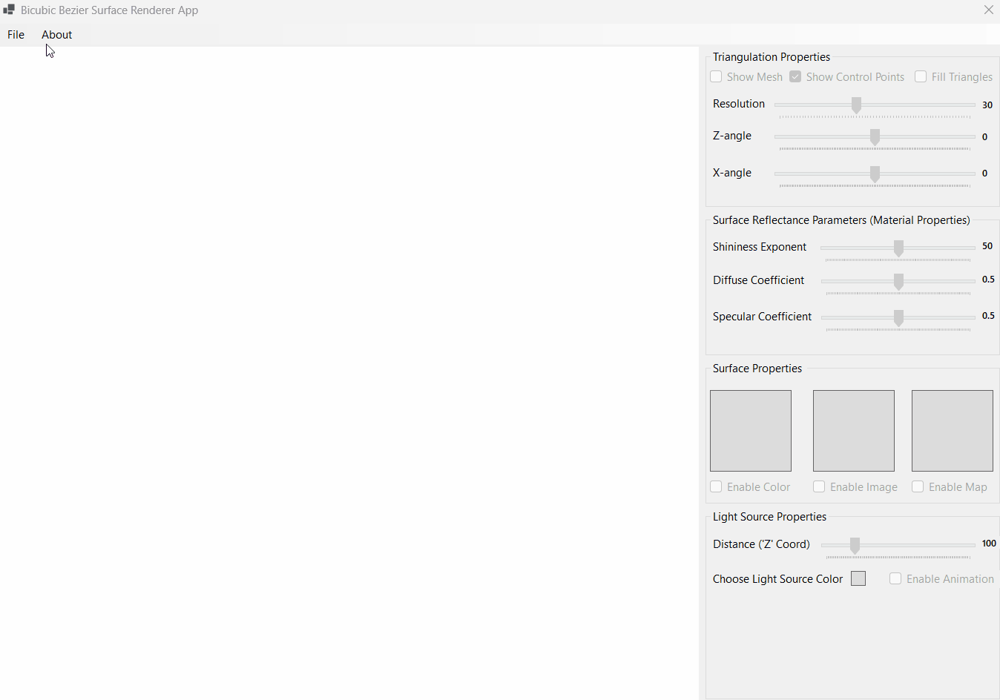
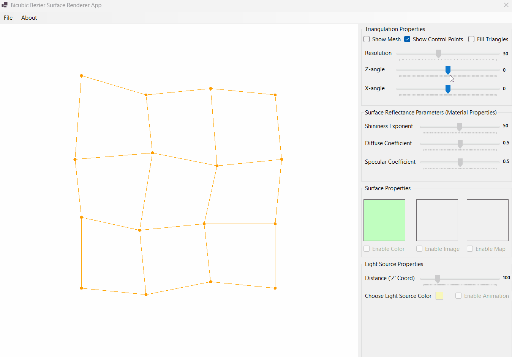
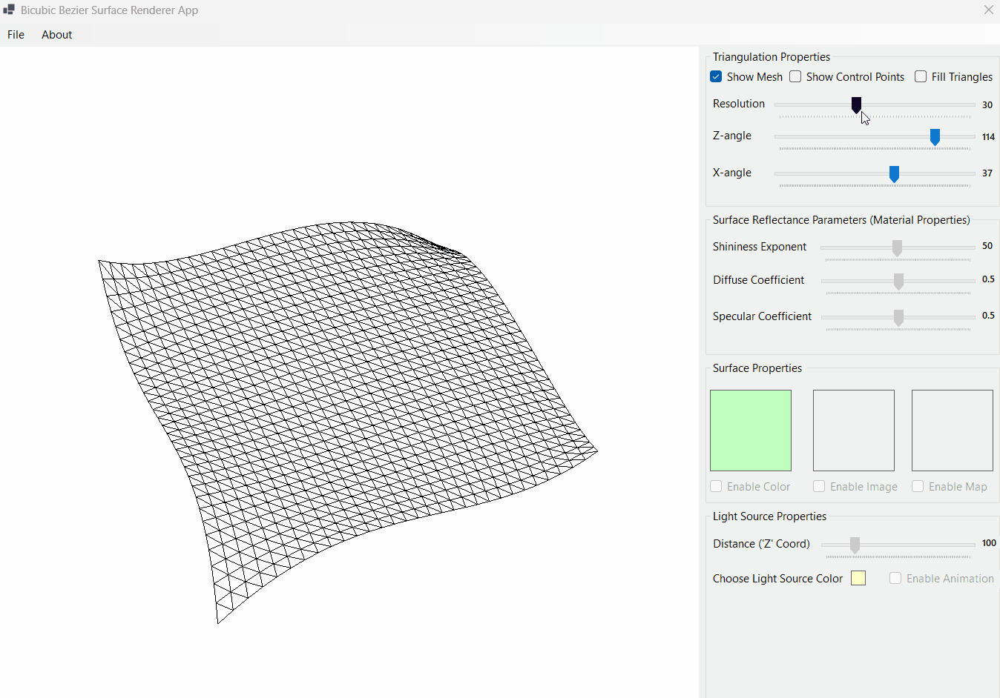
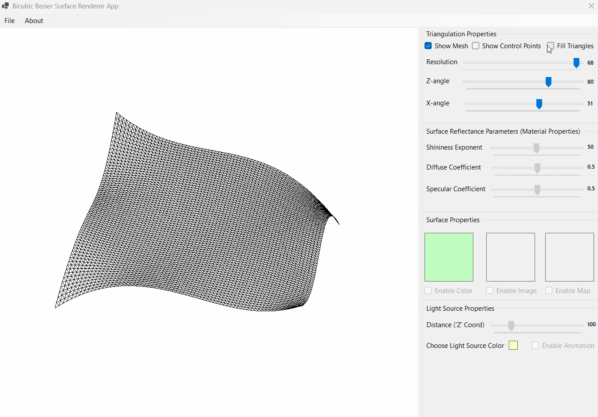

# Bezier Surface Renderer

Bezier Surface Renderer is a WinForms application, that allows its users to render bicubic Bezier surfaces, featuring Phong lighting, texture mapping and dynamic surface deformation. 

The application was created as a part of Computer Graphics course at Warsaw University of Technology (WUT) during the 5th semester of Compputer Science bachelor studies (2025/2026 academic year).

## Main idea

The main idea of the application is to provide a simple and intuitive interface for rendering and manipulating bicubic Bezier surfaces. Users can read control points from a file, manage the dencity of triangulation, manage the position of the light source and turn on/off its animation (movement along a spiral trajectory), apply texture and/or normal maps mapping etc, change the material properties of the surface etc.

Simple and intitive interface allows users to easily navigate through the application and explore the capabilities of Bezier surface rendering.

## Example of usage


## Technical features

1. **Bezier Control Points reading from a file**. Control points coordinates are read from *a text file*, which allows users to create their own surfaces by simple editing the file. The file must contain **16 lines**, each line must contain **3 float numbers** (x, y, z coordinates of a control point) separated by space/spaces. 
I.e. the file may look like this:
```
0.23 0.45 0.67
-0.12 1.23 0.56         16 control points in total
...
23.1 11.123 -98
```

2. **Trinagulation density management**. Users can easily manage *the density of triangulation* of the surface by just modifying a value of appropriate trackbar. The higher the value, the more triangles will be used to render the surface, which results in smoother and more detailed rendering, but also in higher computational cost.

3. **Surface rotation**. Users can *rotate the surface* along X-axis and Z-axis by dragging the appropriate trackbars. This allows users to view the surface from different angles and better understand its shape and structure.

4. **Phong lighting**. The application features Phong lighting model. It allows to achieve realistic lighting effects on the surface. 
**Short explanation of the model**. Every point on the surface is illuminated by a light source. The color of the point is determined by 3 components (in my application by 2 components): diffuse and specular. 
+ **Diffuse component** is calculated based on the angle between the light source and the normal vector of the surface at that point. It simulates the way light scatters on rough surfaces, creating a matte appearance.
+ **Specular component** is calculated based on the angle between the reflected light vector and the viewer's direction. It simulates the way light reflects on shiny surfaces, creating highlights. 

5. **Surface material properties management**. Users can manage *the material properties*: **shininess exponent**, **diffuse coefficient** and **specular coefficient**. It forces changes in the way our surface interacts with light, which results in different visual effects. For example, increasing the shininess exponent will make the surface appear more *glossy and reflective*, while decreasing it will make it look more *matte and rough*.

6. **Other surface properties management**. Users can manage *the surface color*. Moreover, they can turn on/off *the texture mapping* and *the normal mapping*, that allows to achieve some image's mapping on the surface, which results in more detailed and realistic rendering.

7. **Light source management**. Users can manage *the position of the light source* by dragging appropriate trackbars. Moreover, they can turn on/off *the light source animation*, which makes the light source move along a spiral trajectory, creating dynamic lighting effects on the surface.

## Interactive features
| 1. Bezier Control Points reading from a file | 2. Rotation of the surface, enabling/disabling mesh/control points |
| :--: | :--: |
|  |  |
| 3. Managing the density of triangulation | 4. Managing the material properties |
|  |  |
| 5. Managing the surface color, enabling/disabling texture and normal mapping | 6. Managing the light source position and animation |
|  |  |

## Requirements and setup
The application is built using .NET Framework and WinForms, so it requires a compatible environment to run. To set up the application, follow these steps:
1. Clone the repository to your local machine.
2. Open the solution file in Visual Studio.
3. Build the solution to restore any necessary dependencies.
4. Run the application.

## Academic context
This project was developed for the *Computer Graphics* course at Warsaw University of Technology (WUT) during the 5th semester of Computer Science bachelor studies (2025/2026 academic year). 
+ *Faculty*: Faculty of Mathematics and Information Science
+ *Supervisor*: Dr. inż. **Paweł Kotowski**
+ *Grade received*: 23/25 (92%)

## Contact
If you have any questions or suggestions regarding the application, feel free to contact me:
+ **Github**: [@uasuna2022] (https://github.com/uasuna2022)
+ **Email**: [max.gomanchuk@gmail.com] (mailto:max.gomanchuk@gmail.com)
+ **Instagram**: [@m_a_k_s_i_m_g] (https://www.instagram.com/m_a_k_s_i_m_g/)

